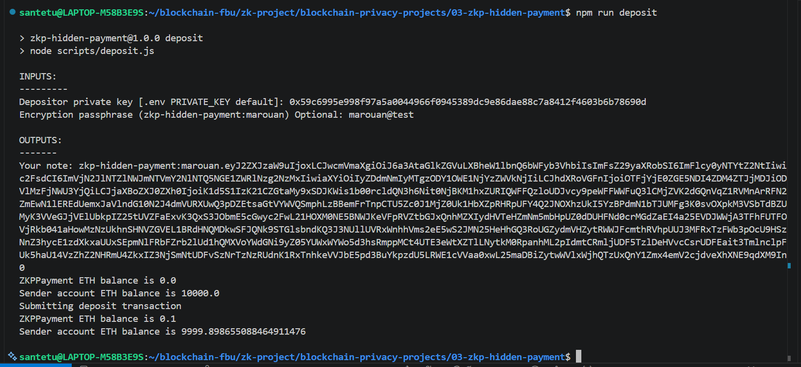
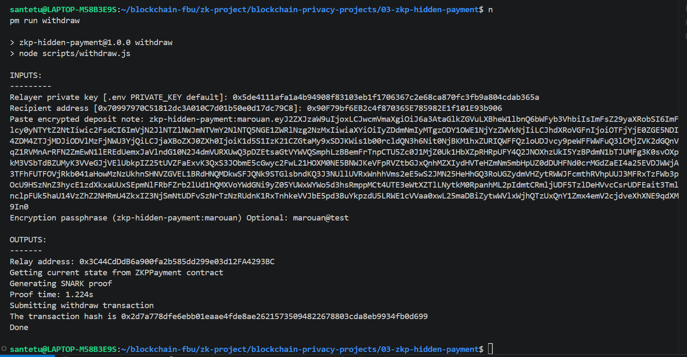
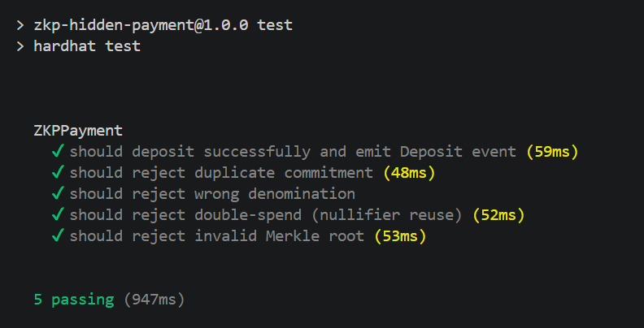

# ZKP Hidden Payment

## Description

Hardhat + Circom project. One address deposits ETH, another withdraws it with no on-chain link between them.

Depositor shares a Poseidon commitment. Withdrawer proves (Groth16 zk-SNARK) they know the secret behind it. Depositor stays anonymous, no way to trace back.

References used:
- `https://github.com/tornadocash/tornado-core`
- `https://github.com/johnson86tw/simple-tornado`
- `https://github.com/nkrishang/tornado-cash-rebuilt`

---

## Branch Info

My branch is 210304121-marouan-boumchahate

---

## Clone the repo

```bash
git clone https://github.com/OsmanSelvi84/blockchain-privacy-projects/
cd blockchain-privacy-projects
git checkout students/210304121-marouan-boumchahate
cd 03-zkp-hidden-payment/
```

---

## Imagination Story

**1. Deposit (Marouan).** Marouan generates a random `secret` and `randomness`, computes `commitment = Poseidon(secret, randomness)`, calls `deposit(commitment)` with exactly `0.1 ETH`. Contract appends the commitment to the Merkle tree and stores the new root.

**2. Proof generation (Marouan / Youness).** Marouan keeps `secret` and `randomness` inside an encrypted note protected with the `zkp-hidden-payment:marouan` prefix. Youness pastes that encrypted note into withdraw, provides the same passphrase to decrypt it, then computes `nullifier = Poseidon(secret)`, builds a Merkle path for his commitment, and uses `snarkjs` to produce a Groth16 proof confirms he knows `(secret, randomness)` behind a commitment in the tree, without revealing which one.

**3. Withdraw (Youness).** Youness submits the proof + `root` + `nullifier` + `recipient`. Contract verifies the proof, marks the nullifier as spent, sends `0.1 ETH` to the recipient. Nothing on-chain connects that to Marouan's deposit address.

---

## Setup - normal (no reset)

> Prefered Path. Everything's already compiled and pre-built (Saves arround 20+ min).

**Requires:** Node.js 18+
[Install instructions](https://www.digitalocean.com/community/tutorials/how-to-install-node-js-on-ubuntu-20-04)

```bash
npm install
```
```bash
cp .env.example .env
```

### 1. Run a local chain

```bash
npm run node
```

### 2. Deploy contracts (new terminal)

```bash
npm run deploy:local
```

Addresses saved to `deployedAddresses.json`.

### 3. Deposit

```bash
npm run deposit
```



> Generates fresh `(secret, randomness)`\
> Computes Poseidon commitment\
> Sends `0.1 ETH`\
> Prints the encrypted note in the console.

### 4. Withdraw

```bash
npm run withdraw
```



> Prompts for the encrypted note string and the encryption passphrase\
> Rebuilds the Merkle tree from past `Deposit` events\
> Computes Groth16 proof\
> Calls `ZKPPayment.withdraw` → sends `0.1 ETH` to `RECIPIENT`.

### 5. Tests

```bash
npm run test
```

Covers:
> Successful deposit\
> Reject duplicate commitments\
> Reject any denomination ≠ 0.1 ETH\
> Reject double-spent nullifier\
> Invalid Merkle tree



---

## Setup - full reset (from scratch)

> Only needed if you reset all generated files by `npm run reset`. Takes 20–30 min minimum.

### 1. Install Rust

```bash
curl --proto '=https' --tlsv1.2 -sSf https://sh.rustup.rs | sh
source "$HOME/.cargo/env"
```

### 2. Install Circom 2

```bash
git clone https://github.com/iden3/circom.git
cd circom
cargo build --release
cargo install --path circom
```

Verify: `circom --version` should show 2.x.x+

### 3. Install npm deps

```bash
npm install
```
```bash
cp .env.example .env
```

### 4. Compile circuits

```bash
npm run build
```

> Compiles `circuits/withdraw.circom`\
> Generates `contracts/Verifier.sol`\
> Copies `withdraw.wasm`.\
> Produces `withdraw_final.zkey`, `verification_key.json`, `circuits/withdraw.wasm`.

### 5. Run a local chain

```bash
npm run node
```

### 6. Deploy contracts (new terminal)

```bash
npm run deploy:local
```

Addresses saved to `deployedAddresses.json`.

### 7. Deposit

```bash
npm run deposit
```


> Generates fresh `(secret, randomness)`\
> Computes Poseidon commitment\
> Sends `0.1 ETH`\
> Prints the encrypted note in the console.

### 8. Withdraw

```bash
npm run withdraw
```


> Prompts for the encrypted note string and the encryption passphrase\
> Rebuilds the Merkle tree from past `Deposit` events\
> Computes Groth16 proof\
> Calls `ZKPPayment.withdraw` → sends `0.1 ETH` to `RECIPIENT`.

### 9. Tests

```bash
npm run test
```

Covers:
> Successful deposit\
> Reject duplicate commitments\
> Reject any denomination ≠ 0.1 ETH\
> Reject double-spent nullifier\
> Invalid Merkle tree


## Reference Implementation

## Clone the repo

```bash
git clone https://github.com/tornadocash/tornado-core.git
cd tornado-core
```

### Requirements

1. `node v22.x` or newer LTS
2. `nvm use` in this repo before running the build
3. `npm` and `npx` from that Node install

### Usage

1. `npm install`
2. `cp .env.example .env`
3. `npx ganache-cli`
4. `npm run build` - this may take 10 minutes or more
5. `npm run test` - [10-20min at least] optionally runs tests. It may fail on the first try, just run it again.

### Initialization

1. `cp .env.example .env`
2. `npm run download`
3. `npm run build:contract`

### Ganache CLI

1. make sure you complete steps from Initialization
2. `npm run migrate:dev`
3. `src/cli.js test`

### Deposit

```bash
src/cli.js deposit ETH 0.1
```

> Your note: tornado-eth-0.1-42-0xf73dd6833ccbcc046c44228c8e2aa312bf49e08389dadc7c65e6a73239867b7ef49c705c4db227e2fadd8489a494b6880bdcb6016047e019d1abec1c7652\
> Tornado ETH balance is 8.9\
> Sender account ETH balance is 1004873.470619891361352542\
> Submitting deposit transaction\
> Tornado ETH balance is 9\
> Sender account ETH balance is 1004873.361652048361352542\

### Withdraw

```bash
src/cli.js withdraw <your note> <recipient>
```

> Relay address: 0x6A31736e7490AbE5D5676be059DFf064AB4aC754\
> Getting current state from tornado contract\
> Generating SNARK proof\
> Proof time: 9117.051ms\
> Submitting withdraw\
> The transaction hash is 0x2bc214d34fd73541d00148f7c01336df8e4fc702ec8e32e66ff0a4f29e2c1b83\
> Done
