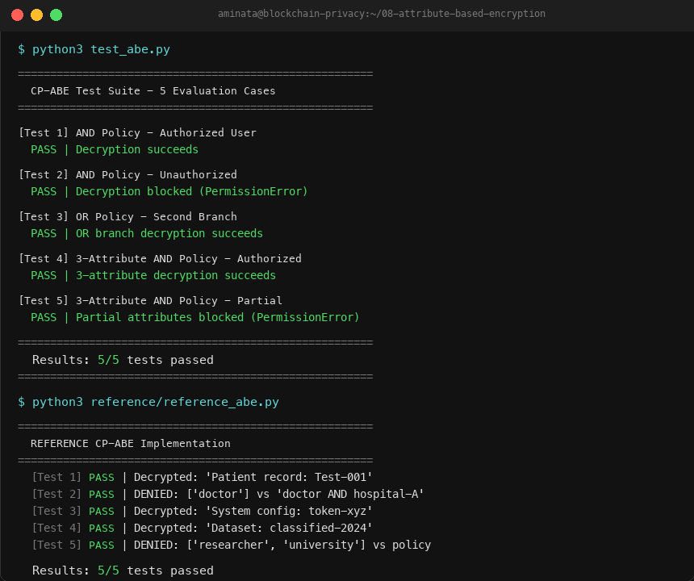

# Attribute-Based Encryption (CP-ABE)

**Course:** COMP4052 — Introduction to Blockchain and DLT
**Student:** Aminata Kone | **ID:** 220304144
**Branch:** students/220304144-aminata-kone
**Instructor:** Osman SELVİ

---

## Project Description

This project implements Ciphertext-Policy Attribute-Based Encryption (CP-ABE), a privacy-preserving access control scheme. The access policy is embedded in the ciphertext and user attributes are stored in the private key. Decryption only succeeds when the user's attributes satisfy the policy — no central authority is needed to enforce access.

**Privacy Concept:** Fine-grained, decentralized, cryptographic access control for blockchain data.

**Key features:**
- AND / OR policy logic with arbitrary nesting and parentheses
- Recursive PolicyNode tree for policy parsing and evaluation
- AES-GCM authenticated encryption
- SHA-256 master secret key derivation
- Clean separation of Authority, Encryptor, and Decryptor components

---

## Branch Information

Student branch: students/220304144-aminata-kone
Project folder: 08-attribute-based-encryption

---

## Project Structure
cat > README.md << 'ENDOFFILE'
# Attribute-Based Encryption (CP-ABE)

**Course:** COMP4052 — Introduction to Blockchain and DLT
**Student:** Aminata Kone | **ID:** 220304144
**Branch:** students/220304144-aminata-kone
**Instructor:** Osman SELVİ

---

## Project Description

This project implements Ciphertext-Policy Attribute-Based Encryption (CP-ABE), a privacy-preserving access control scheme. The access policy is embedded in the ciphertext and user attributes are stored in the private key. Decryption only succeeds when the user's attributes satisfy the policy — no central authority is needed to enforce access.

**Privacy Concept:** Fine-grained, decentralized, cryptographic access control for blockchain data.

**Key features:**
- AND / OR policy logic with arbitrary nesting and parentheses
- Recursive PolicyNode tree for policy parsing and evaluation
- AES-GCM authenticated encryption
- SHA-256 master secret key derivation
- Clean separation of Authority, Encryptor, and Decryptor components

---

## Branch Information

Student branch: students/220304144-aminata-kone
Project folder: 08-attribute-based-encryption

---

## Project Structure
08-attribute-based-encryption/
├── abe.py                  Original CP-ABE implementation
├── test_abe.py             5 evaluation test cases
├── requirements.txt        Python dependencies
├── README.md               This file
├── docs/
│   └── test_output.png     Screenshot of passing test results
└── reference/
└── reference_abe.py    Standalone reference implementation for comparison

---

## Required Software

- Python 3.8 or higher
- pip3

Check your Python version:

```bash
python3 --version
```

---

## Step 1 — Clone the Repository

```bash
git clone https://github.com/OsmanSelvi84/blockchain-privacy-projects.git
cd blockchain-privacy-projects
```

---

## Step 2 — Switch to Student Branch

```bash
git checkout students/220304144-aminata-kone
cd 08-attribute-based-encryption
```

---

## Step 3 — Install Dependencies

```bash
pip3 install -r requirements.txt
```

Or manually:

```bash
pip3 install cryptography
```

---

## Step 4 — Run the Original Implementation

```bash
python3 abe.py
```

This runs a full demo with 5 scenarios covering authorized access, denied access, OR policies, complex 3-attribute policies, and partial attribute failure.

---

## Step 5 — Run the Test Suite

```bash
python3 test_abe.py
```

Expected output:
=======================================================
CP-ABE Test Suite - 5 Evaluation Cases
[Test 1] AND Policy - Authorized User
PASS | Decryption succeeds
[Test 2] AND Policy - Unauthorized
PASS | Decryption blocked (PermissionError)
[Test 3] OR Policy - Second Branch
PASS | OR branch decryption succeeds
[Test 4] 3-Attribute AND Policy - Authorized
PASS | 3-attribute decryption succeeds
[Test 5] 3-Attribute AND Policy - Partial (Fail)
PASS | Partial attributes blocked (PermissionError)
=======================================================
Results: 5/5 tests passed

---

## Sample Inputs and Outputs

| Test | Policy | User Attributes | Expected Result |
|------|--------|----------------|-----------------|
| 1 | doctor AND hospital-A | [doctor, hospital-A] | DECRYPTS |
| 2 | doctor AND hospital-A | [doctor] | DENIED |
| 3 | (doctor AND hospital-A) OR admin | [admin] | DECRYPTS |
| 4 | (researcher AND university) AND clearance-L2 | [researcher, university, clearance-L2] | DECRYPTS |
| 5 | (researcher AND university) AND clearance-L2 | [researcher, university] | DENIED |

---

## Test Output Screenshot



---

## Reference Implementation

**Project:** Charm-Crypto Framework (Waters CP-ABE scheme)
**Repository:** https://github.com/JHUISI/charm
**Scheme file:** charm/schemes/abenc/abenc_bsw07.py
**Language:** Python

### Option A — Full Charm-Crypto Install

```bash
git clone https://github.com/JHUISI/charm.git
cd charm
pip3 install -r requirements.txt
python3 setup.py install
cd schemes/abenc
python3 abenc_bsw07.py
```

### Option B — Standalone Reference (Recommended)

No complex installation needed. Uses only the cryptography library:

```bash
pip3 install cryptography
python3 reference/reference_abe.py
```

Expected output: 5/5 tests passed

---

## Reproducing the Demo Environment

To fully reproduce everything from scratch:

```bash
git clone https://github.com/OsmanSelvi84/blockchain-privacy-projects.git
cd blockchain-privacy-projects
git checkout students/220304144-aminata-kone
cd 08-attribute-based-encryption
pip3 install -r requirements.txt
python3 abe.py
python3 test_abe.py
python3 reference/reference_abe.py
```

All three commands should run without errors.

---

## Difference Between Reference and Original

| | Original (abe.py) | Reference (reference_abe.py) |
|---|---|---|
| Key derivation | SHA-256 + master secret | HMAC-SHA3-256 |
| Policy parsing | Recursive PolicyNode tree | Inline token parser |
| Encryption | AES-GCM | AES-GCM |
| Access control result | Identical on all 5 tests | Identical on all 5 tests |

---

## Academic Integrity

This is an original implementation developed from scratch by Aminata Kone.
The Charm-Crypto framework was used as a reference for learning purposes only.
All code was written independently with no direct copying.
